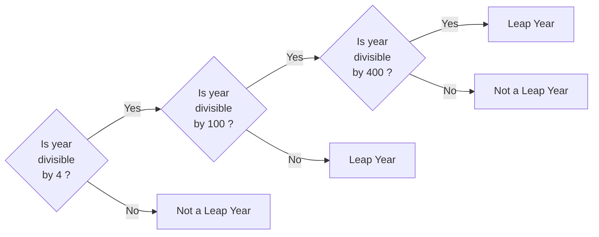

# Practice Questions

## Qn 1.

Write a Java program to get a number from the user and print whether it is positive or negative.

## Qn 2.

Finish the following code so that it prints You have a fever if your temperature is above 100 and otherwise prints You don't have a fever.

```java
public class Solution { 
    public static void main(String[] args) {
        double temp = 103.5;
    }
}
```

## Qn 3.

Write a Java program to input week number (1-7) and print day of week name using switch case.

## Qn 4.

What will be the value of x & y in the following program:

```java
public class Solution {
    public static void main(String[] args) {
        int a = 63, b = 36;

        boolean x = ( a < b) ? true : false;
        int y = (a > b) ? a : b;
    }
}
```

## Qn 5.

Write a Java program that takes a year from the user and print whether that year is a leap year or not.

**Hint:**


