# Flowcharts and Pseudocode

- **Flowcharts** - Diagram to represent the solution to a problem.
- **Pseudocode** - A detailed yet readable description of what a computer program or algorithm should do.

## Flowchart Symbols Reference

### Terminal


The oval symbol marks the Start and Stop of a flowchart. It is always the first and last symbol in the flow.

### Input/Output

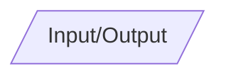

The parallelogram represents any input or output operation, such as reading data from the user or displaying a result.

### Process

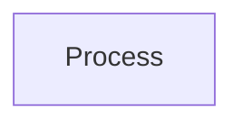

The rectangle represents a process, a calculation, an assignment, or any action performed on data (e.g., `sum = a + b`).

### Decision

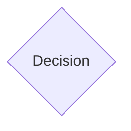

The diamond represents a decision point, a yes/no or true/false condition that splits the flow into two or more paths.

### Flow Line

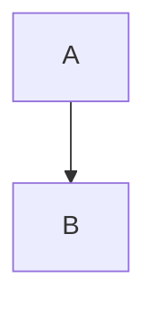

The arrow shows the direction of flow, the exact order in which instructions are executed.

## 1. Calculate Sum of 2 Numbers

### Pseudocode

```
1. Start
2. Input a and b
3. Calculate sum = a + b
4. Print sum
5. Stop
```

### Flowchart

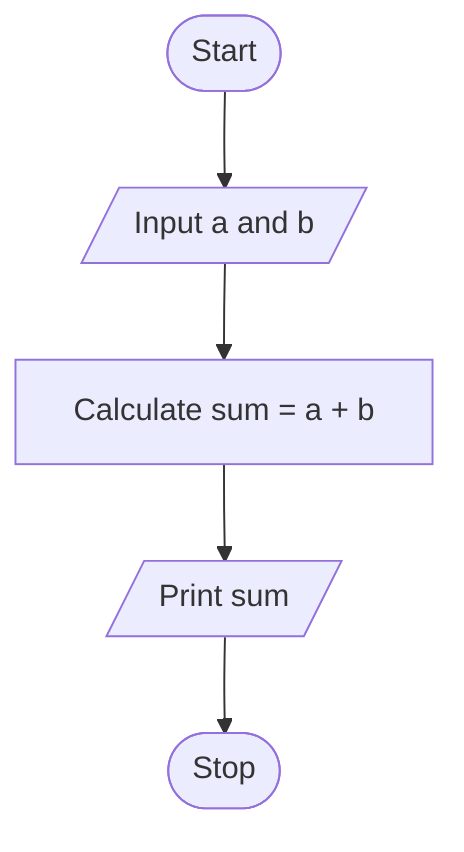

## 2. Calculate Simple Interest

### Pseudocode

```
1. Start
2. Input principal p, rate r, and time t
3. Calculate SI = (p * r * t) / 100
4. Print SI
5. Stop
```

### Flowchart

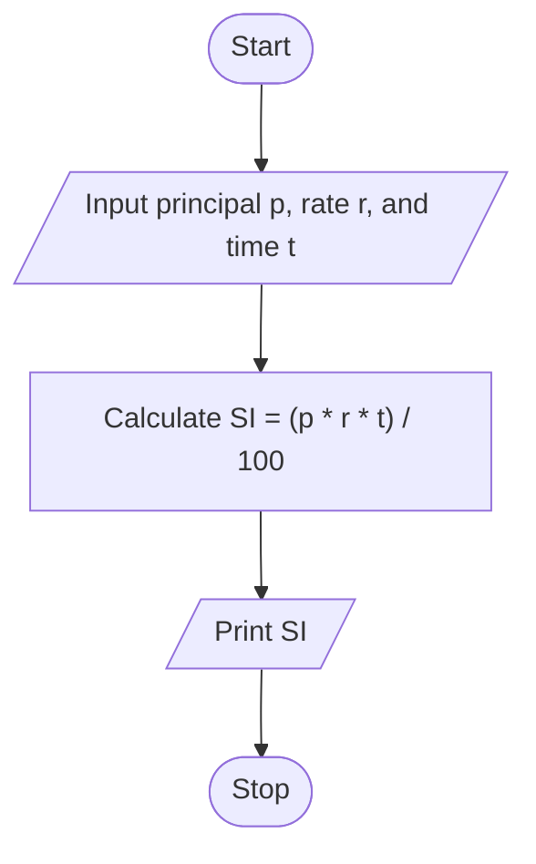

## 3. Find Maximum of 3 Numbers

### Pseudocode

```
1. Start
2. Input a, b, and c
3. If a >= b and a >= c then
       Print a
   Else If b >= c then
       Print b
   Else
       Print c
4. Stop
```

### Flowchart

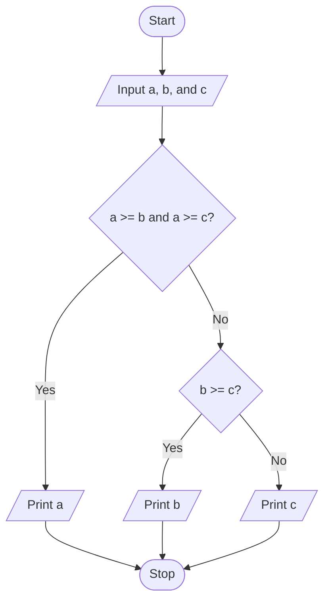

## 4. Find if a Number is Prime or Not

### Pseudocode

```
1. Start
2. Input n
3. If n < 2 then
       Print "Not prime"
       Stop
4. Set div = 2
5. While div * div <= n do
       If n % div = 0 then
           Print "Not prime"
           Stop
       Else
           div = div + 1
6. Print "Prime"
7. Stop
```

### Flowchart

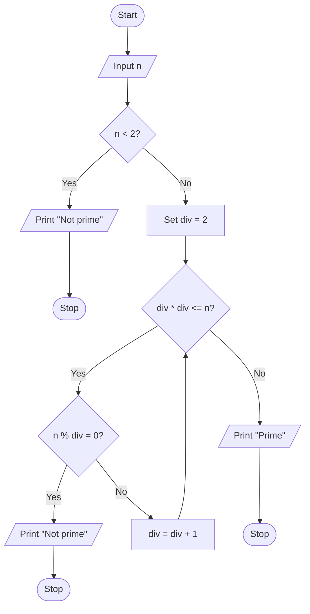

## 5. Calculate Sum of First N Natural Numbers

### Pseudocode

```
1. Start
2. Input n
3. Set val = 1 and sum = 0
4. While val <= n do
       sum = sum + val
       val = val + 1
5. Print sum
6. Stop
```

### Flowchart

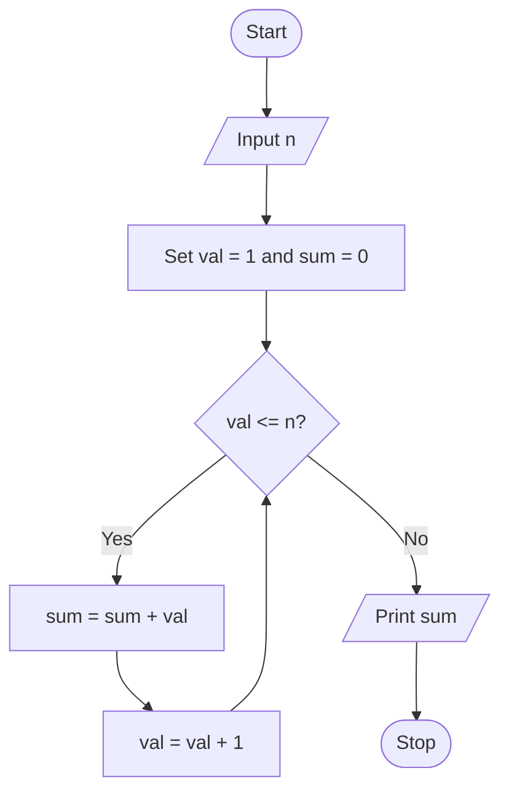

## 6. Calculate Area of a Circle

### Pseudocode

```
1. Start
2. Input radius r
3. Calculate area = PI * r * r
4. Print area
5. Stop
```

### Flowchart

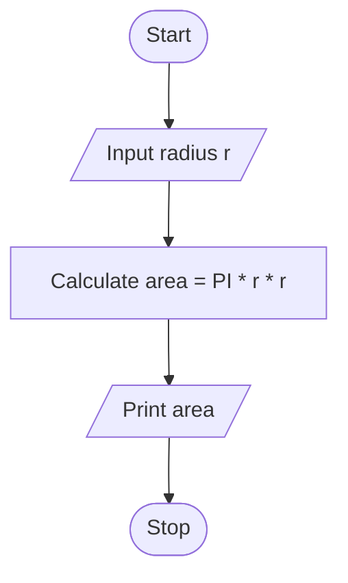

## 7. Find the Greatest from 2 Numbers

### Pseudocode

```
1. Start
2. Input a and b
3. If a > b then
       Print a
   Else If b > a then
       Print b
   Else
       Print "Both are equal"
4. Stop
```

### Flowchart

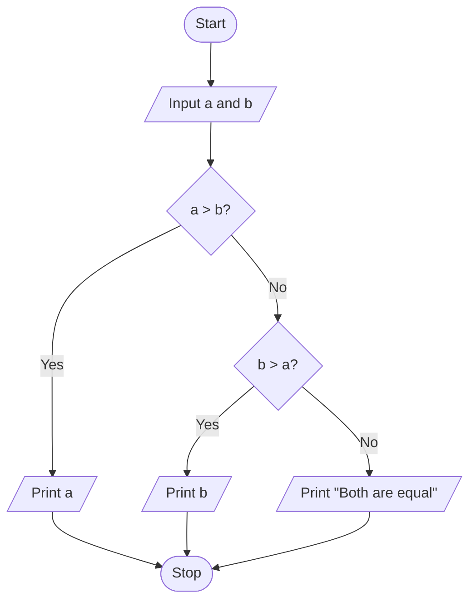

## 8. Print Even Numbers Between 9 and 100

### Pseudocode

```
1. Start
2. Set num = 10
3. While num <= 98 do
       Print num
       num = num + 2
4. Stop
```

### Flowchart

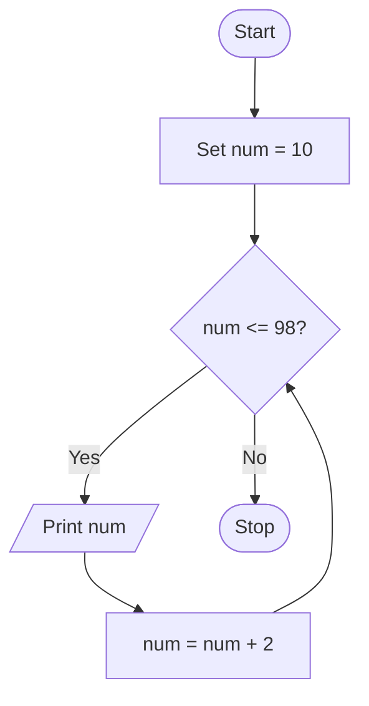

## 9. Calculate Average from 25 Exam Scores

### Pseudocode

```
1. Start
2. Set sum = 0 and c = 0
3. While c < 25 do
       Input exam score s
       sum = sum + s
       c = c + 1
4. Calculate avg = sum / 25
5. Print avg
6. Stop
```

### Flowchart

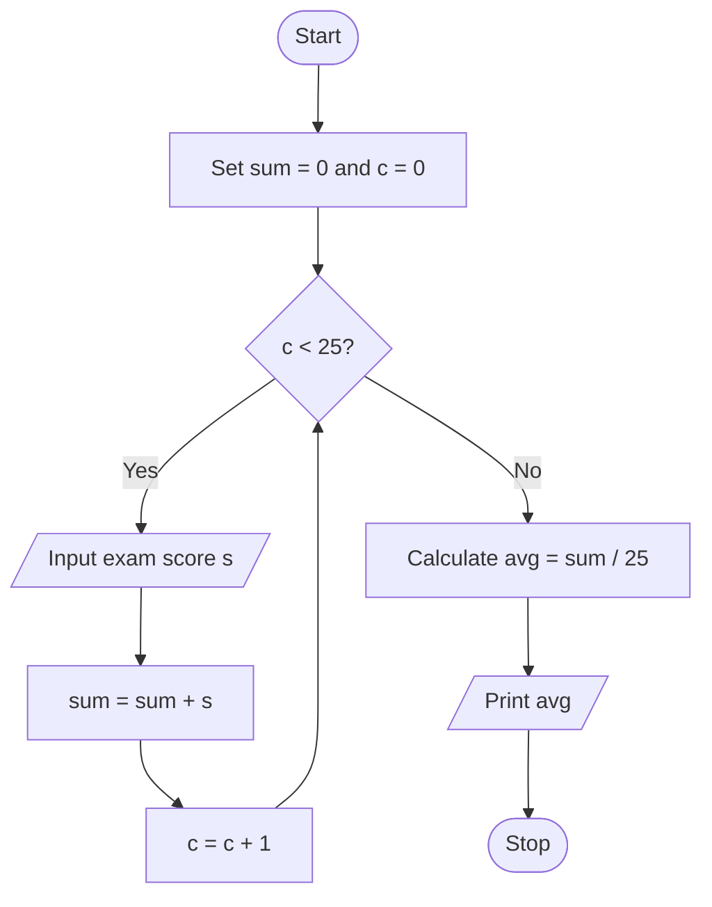

## 10. Find Roots of a Quadratic Equation ax<sup>2</sup> + bx + c = 0

### Pseudocode

```
1. Start
2. Input a, b, and c
3. If a = 0 then
       Print "Not a quadratic equation"
       Stop
4. Calculate D = b^2 - 4ac
5. If D >= 0 then
       root1 = (-b + sqrt(D)) / (2a)
       root2 = (-b - sqrt(D)) / (2a)
       Print root1 and root2
   Else
       rp = -b / (2a)
       ip = sqrt(-D) / (2a)
       root1 = rp + i * ip
       root2 = rp - i * ip
       Print root1 and root2
6. Stop
```

### Flowchart

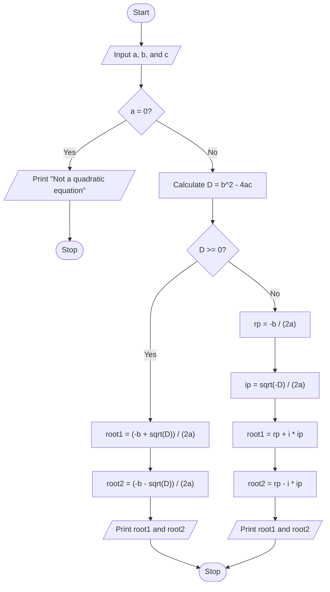
