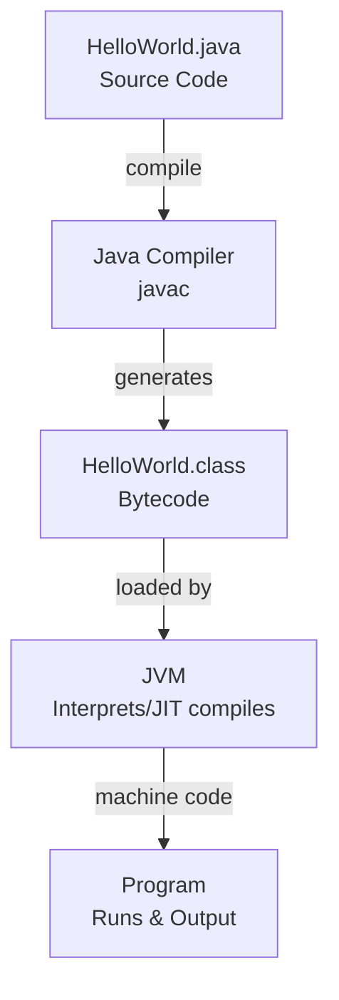

# Introduction to Java

Java is a high-level, object-oriented programming language originally developed by Sun Microsystems and released in 1995. Sun was later acquired by Oracle in 2010, and Oracle has maintained Java since. It is a general-purpose language designed with the principle of "write once, run anywhere" (WORA), meaning that compiled Java code can run on all platforms that support Java without the need for recompilation.

Java applications are typically compiled to bytecode that runs on any Java Virtual Machine (JVM), regardless of the underlying computer architecture. Its syntax is similar to C and C++, but it has fewer low-level facilities than either language. The Java runtime also provides dynamic capabilities, such as reflective programming (reflection) and runtime code modification, which are usually unavailable in traditional compiled languages. Java is widely used for building desktop applications, web applications, Android apps, and enterprise systems.

## Key Features

- **Platform Independent:** Code compiles into bytecode that runs on any JVM. "Write Once, Run Anywhere."
- **Object-Oriented Programming (OOP):** Java supports OOP concepts to create modular and reusable code.
- **Statically Typed:** Variables must be declared with a type. Compiler catches errors early.
- **Robust, Secure, and Memory-Safe:** Java ensures reliability through automatic memory management (allocation and deallocation via garbage collection, which prevents memory leaks), strong exception handling, and built-in security features like bytecode verification and sandboxing.
- **Multithreading and Concurrency:** Java allows concurrent execution of multiple tasks for efficiency.

## Hello World Program in Java

```java
public class HelloWorld {                     // Declares a public class named HelloWorld. File must be HelloWorld.java
    public static void main(String[] args) {  // Main method - entry point of the program
        System.out.println("Hello World!");   // Prints "Hello World!" to the console
    }                                         // End of main method
}                                             // End of class
```

### Output

```
Hello World!
```

## How does Java code run?



- Write code in a file like `HelloWorld.java`.
- Java Compiler (`javac`) compiles the source code into bytecode, generating a file named `HelloWorld.class`.
- The Java Virtual Machine (JVM) loads the `.class` file and initially interprets the bytecode line by line.
- The JVM identifies **frequently executed code** (hot spots) and uses the **Just-In-Time (JIT) compiler** to convert that bytecode into **native machine code** (binary 0s and 1s) for better performance. The program then executes and produces the output.
