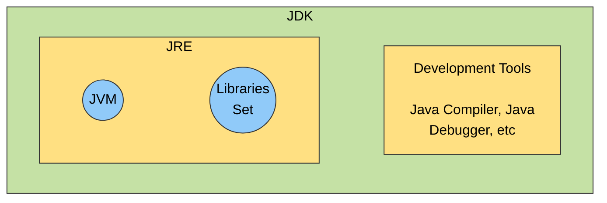

# Differences Between JDK, JRE, and JVM

JDK (Java Development Kit) provides the tools and libraries needed to build Java applications. JRE (Java Runtime Environment) supplies the libraries and the JVM required to run Java programs. JVM (Java Virtual Machine) executes compiled Java bytecode on the system.

- JDK is primarily used by developers, while JRE is intended for end-users who only need to run applications.
- JVM executes the bytecode, enabling platform independence.

> [!NOTE]
> Java bytecode can run on any machine that has a JVM, but JVM implementations are platform-specific.

## JDK (Java Development Kit)

JDK is a complete development kit used to build Java applications. It includes the JRE along with development tools.

- Contains the compiler (`javac`), debugger, and utilities like `jar` and `javadoc`.
- Includes the JRE, so it can also run Java programs.
- Essential for developers to write, compile, and debug code.

### Components of JDK

- JVM + core libraries (traditionally packaged separately as the JRE)
- Development tools (compiler, debugger, `jar`, `javadoc`)

### Notes

- JDK is intended for development, but because it includes the JRE, it can also run Java applications.
- JDK is platform-dependent (different versions for Windows, Linux, and macOS).

### How JDK Works

- **Source Code (`.java`):** The developer writes the program.
- **Compilation:** The `javac` compiler converts the source code into bytecode (`.class` files).
- **Execution:** The JVM runs the bytecode and translates it into native machine instructions.

## JRE (Java Runtime Environment)

JRE provides the environment to run Java programs. It does not include any development tools and is meant for end-users.

- Includes the JVM and standard class libraries.
- Provides everything needed to run Java applications.
- Does not support compiling or debugging.

### Notes

- JRE is designed only for running applications, not for development.
- It is platform-dependent (different builds for different operating systems).

> [!IMPORTANT]
> Since Java 11, a standalone JRE is no longer offered as a separate download by Oracle — the JDK is now the standard install for both developers and end-users.

### How JRE Works

- **Class Loading:** Loads the compiled `.class` files into memory.
- **Bytecode Verification:** Checks bytecode for security and correctness.
- **Execution:** Uses the JVM (with interpreter and JIT compiler) to run the code and handle system calls.

## JVM (Java Virtual Machine)

JVM is the core engine that runs Java applications. It translates bytecode into machine-specific instructions.

- Present in both JDK and JRE.
- Handles memory management and garbage collection.
- Enables portability by running the same bytecode on different platforms.

### Notes

- JVM implementations are platform-specific.
- Bytecode is platform-independent and can run on any JVM.
- Modern JVMs use Just-In-Time (JIT) compilation to improve performance.

### How JVM Works

- **Loading:** The class loader loads bytecode into memory.
- **Linking:** Verifies, prepares, and resolves references.
- **Initialization:** Runs class constructors and static blocks.
- **Execution:** Interprets or compiles bytecode into native machine code.

## JDK vs JRE vs JVM

| Component | Purpose | Includes | Platform Dependency |
|-----------|---------|----------|---------------------|
| **JDK** (Java Development Kit) | Build Java applications | JRE + Development tools (javac, debugger, etc.) | Platform-dependent |
| **JRE** (Java Runtime Environment) | Run Java applications | JVM + Core libraries | Platform-dependent |
| **JVM** (Java Virtual Machine) | Execute Java bytecode | Class Loader, Execution Engine (Interpreter + JIT), Garbage Collector | JVM is OS-specific, but bytecode is not |

**Key Point:** Java bytecode is platform-independent, but the JVM is platform-dependent. This is what enables Java's **"write once, run anywhere"** capability.
